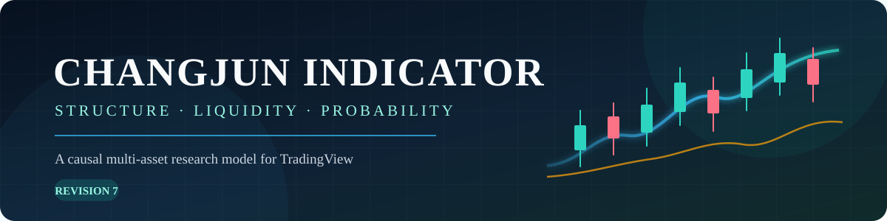
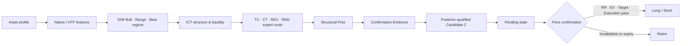

<p align="center">
  
</p>

<p align="center">
  
  
  
  
</p>

<p align="center">
  A causal multi-asset market-structure and probability engine for TradingView.
</p>

> [!IMPORTANT]
> 이 저장소는 연구·개발 중인 보조지표입니다. 매수·매도 권유, 자동매매 시스템 또는 수익 보장을 제공하지 않습니다.

## Overview

Changjun Market Engine는 시장에서 확인된 사건을 순서대로 기록하고, 시장 환경 → 구조적 설정 → 확인 증거 → 실행 가능성을 서로 다른 단계에서 평가하는 Pine Script기반 의사결정 모델입니다.

이 프로젝트는 고점과 저점을 미리 맞히는 것보다 다음 원칙을 우선합니다.

- 확정되지 않은 Pivot이나 미래 HTF 정보를 사용하지 않습니다.
- Sweep, 구조 전환, Displacement와 Zone 반응의 발생 순서를 보존합니다.
- 좋은 분석 위치와 실제 진입 가능한 가격을 구분합니다.
- 신호 개수를 늘리기 위한 임의의 threshold 완화보다 검증 가능한 구조를 우선합니다.

### What the model evaluates

| Domain | 역할 |
|---|---|
| Market context | Asset Profile과 Daily/Weekly Regime으로 Bull, Bear, Range 환경 분류 |
| Structure & liquidity | BOS, CHOCH, MSS, Sweep, EQH/EQL과 외부 유동성 추적 |
| Price delivery | FVG/IFVG와 Native Order Block의 생성·반응·소비·무효화 관리 |
| Expert routing | 시장 환경에 따라 TC, CT, REV, RNG 설정을 분리 |
| Probability | 구조적 Prior와 새 Evidence를 분리해 Candidate 품질 평가 |
| Execution | Pending 이후 가격 확인, RR, EV와 목표 도달 가능성으로 L/S 결정 |

최종 `L/S`는 하나의 조건식이 우연히 참이 되어 출력되는 표식이 아니라, 인과 순서와 상태를 통과한 결과입니다. 
반대로 `C`는 분석할 가치가 생긴 후보일 뿐 아직 매수·매도 신호가 아닙니다.

## Current release

| Revision | File | 상태 | 핵심 변경 |
|---|---|---|---|
| R7 | [`R7`](./R7) | Static validated / TradingView validation pending | Probability responsibility refactor, Native causal OB, asset-aware target model |
| R5 | [`R5`](./R5) | Historical checkpoint | Bull/Bear/Range expert routing |
| Legacy | [`ing`](./ing) | Archived working snapshot | 초기 개발 스냅샷 |

R7이 현재 개발 기준입니다. (26.10.08 기준)

## Model flow



R7에서는 같은 정보를 여러 단계에서 반복 탈락시키지 않도록 역할을 분리했습니다.

| Layer | 책임 |
|---|---|
| Prior | 구조 상태, 위치, 유동성, Regime |
| Evidence / Posterior | Displacement, reaction, acceptance, coherence 등 새 확인 정보 |
| Target / EV | 방향 위험, adverse selection, 보상 대비 위험 |
| Final | Posterior latch, RR, EV, 목표확률, 실행 상태, 가격 확인 |

자세한 설계는 [`docs/ARCHITECTURE.md`](docs/ARCHITECTURE.md)를 참고하세요.

## Quick start

1. [`R7`](./R7) 파일을 열고 전체 코드를 복사합니다.
2. TradingView의 Pine Editor에 붙여넣습니다.
3. 저장 후 Add to chart를 선택합니다.
4. `Asset Profile`을 `Auto`로 두거나 Crypto, US Semiconductor, Tech ETF 중 하나를 직접 선택합니다.
5. 먼저 4H·1D·1W에서 구조와 후보 상태를 확인합니다.


## Signal guide

| 표시 | 의미 |
|---|---|
| `BOS ↑/↓` | 저장된 구조 방향과 같은 방향의 확정 스윙 종가 돌파 |
| `CHOCH ↑/↓` | 기존 구조 방향에 반대되는 첫 구조 돌파 |
| `MSS ↑/↓` | 최근 반대편 유동성 sweep을 동반한 CHOCH |
| `MSWP` | Major liquidity sweep |
| `SWP` / `m` | 조건을 통과한 Minor sweep / Raw minor sweep |
| `EQH` / `EQL` | ATR 허용폭 안에 형성된 동일 고점·저점 유동성 |
| `C` | 확률 조건을 통과한 one-shot Candidate. 아직 진입 신호가 아님 |
| `L` / `S` | Pending 이후 가격 확인과 실행 조건을 통과한 Long / Short |

전체 표시와 라인 설명은 [`docs/SIGNALS.md`](docs/SIGNALS.md)에 정리되어 있습니다.

## Timeframe routing

| Chart TF | Native | HTF1 | HTF2 |
|---|---|---|---|
| Below 1D, including 4H | Chart TF | 1D | 1W |
| 1D to below 1W | Chart TF | 1W | 1M |
| 1W and above | Chart TF | 1M | Disabled |

- `Show Native TF Zones`: 현재 차트 시간대의 FVG/IFVG
- `Show HTF1 Zones`: 한 단계 높은 핵심 시간대
- `Show HTF2 Zones`: 두 단계 높은 핵심 시간대
- Native Order Block은 R6/R7에서 진단 레이어로 유지되며 아직 L/S 하드 게이트가 아닙니다.

## Validation policy

이 프로젝트는 신호 개수를 늘리기 위해 임계값을 먼저 완화하지 않습니다.

- Confirmed-bar causal ordering
- Candidate → 최소 1봉 이후 confirmation
- Invalidation과 expiry 우선 처리
- BTC/ETH, US semiconductor, QQQ/QLD 분리 검증
- In-sample / out-of-sample 분리
- MAE/MFE, 목표·손절 도달률, Expert/Regime별 성능 기록
- 검증 결과가 존재할 때만 calibration 수행

현재 단계와 이후 계획은 [`docs/ROADMAP.md`](docs/ROADMAP.md), 변경 내역은 [`docs/CHANGELOG.md`](docs/CHANGELOG.md)에서 확인할 수 있습니다.

## Repository structure

```text
.
├── R7                     # Current research revision
├── R5                     # Historical expert-model checkpoint
├── ing                    # Legacy working snapshot
├── assets/
│   └── header.svg         # README header artwork
└── docs/
    ├── ARCHITECTURE.md    # Model boundaries and causal design
    ├── CHANGELOG.md       # Revision history
    ├── ROADMAP.md         # R0-R10 plan and validation gates
    └── SIGNALS.md         # Chart symbols and lines
```

## Risk notice

과거 차트에서 좋은 위치에 표시된 구조 신호가 미래 성과를 보장하지 않습니다. Pivot, confirmed close, 상위 시간봉 확정값을 사용하는 특성상 일부 신호는 가격 움직임 이후에 확인됩니다. 실제 거래 전에는 수수료, 슬리피지, 유동성, 거래 시간과 손실 한도를 별도로 고려해야 합니다.

---

<p align="center"><sub>Changjun Market Engine · Designed and maintained by ChangJun · Pine Script® v6 research project</sub></p>
